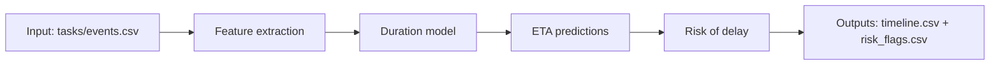

# P06 — Timeline Prediction Engine

_Predice cuándo ocurrirá un hito (ETA) a partir de historial y señales._

## Resumen

Soy Hugo Baghetti. Simula tiempos entre hitos; ajusta un modelo simple para estimar ETA y muestra error vs baseline.

## Por qué hice este proyecto

En escenarios reales, detectar cambios a tiempo reduce costo operacional, evita incidentes y mejora la toma de decisiones.
Este proyecto es una demo **reproducible** (V1) orientada a entrevistas y portafolio.

## Qué demuestra (en trabajo real)

- Diseño de un flujo analítico simple (datos → modelo/reglas → métricas → salida).
- Pensamiento operacional: alertas, umbrales, priorización y trazabilidad.
- Documentación y estructura de proyecto lista para escalar (V2+).

## 🧠 Arquitectura / Flujo




## Estructura del proyecto

- `data/`
- `notebooks/`
- `img/`
- `outputs/`
- `src/`

## Qué hace cada archivo

- `notebooks`
- `src`
- `data/DATA_DICTIONARY.md`
- `outputs/OUTPUTS_DICTIONARY.md`
- `README.md`
- `notebooks/p06_timeline_prediction_engine.ipynb`

## Instalación

Desde la **raíz del repo**:

```bash
python3 -m venv .venv
source .venv/bin/activate
python -m pip install -U pip
pip install -r requirements.txt
```

## Ejecución

- **Notebooks**: abre el notebook en `notebooks/` (VS Code o Jupyter).
- **Scripts** (si existen): ejecuta `python src/<script>.py`.

Ejemplo (si usas Jupyter):

```bash
jupyter notebook
```

## Entradas y salidas

- Diccionario de entradas: `data/DATA_DICTIONARY.md`
- Diccionario de salidas: `outputs/OUTPUTS_DICTIONARY.md`

Además, a nivel repositorio:
- `DATA_DICTIONARY.md`
- `OUTPUTS_DICTIONARY.md`

## Metodología (resumen técnico)

V1 usa datos simulados para reproducibilidad. En V2 se reemplaza por datos reales/abiertos del dominio del proyecto y se agregan:
- validación cruzada / backtesting,
- métricas de negocio,
- monitoreo (drift / calidad).

## Resultados esperables / cómo interpretar

- Verás una figura principal en `img/` y/o tablas en `outputs/`.
- El foco es explicar **qué detectamos**, **por qué**, y **qué acción dispararías**.

## Contacto & Presencia Online

- 📧 `teleobjetivo.boutique@gmail.com`
- 🌐 `www.teleobjetivo.cl`
- 📸 IG: `@tele.objetivo`
- 💻 GitHub: `https://github.com/teleobjetivo`

---

# P06 — Timeline Prediction Engine

_Predicts when a milestone will happen (ETA) based on history and signals._

## Summary

I'm Hugo Baghetti. Simulates time-to-milestone; fits a simple model for ETA and shows error vs baseline.

## Why I built this

In real operations, detecting changes early reduces cost, prevents incidents, and improves decision-making.
This is a **reproducible** V1 demo for interviews and portfolio.

## What this demonstrates (real work)

- A simple analytics flow (data → model/rules → metrics → output).
- Operational thinking: alerts, thresholds, prioritization, and traceability.
- A project structure ready to scale (V2+).

## 🧠 Architecture / Flow

 

## Project structure

- `data/`
- `notebooks/`
- `img/`
- `outputs/`
- `src/`

## What each file does

- `notebooks`
- `src`
- `data/DATA_DICTIONARY.md`
- `outputs/OUTPUTS_DICTIONARY.md`
- `README.md`
- `notebooks/p06_timeline_prediction_engine.ipynb`

## Setup

From the **repo root**:

```bash
python3 -m venv .venv
source .venv/bin/activate
python -m pip install -U pip
pip install -r requirements.txt
```

## Run

- **Notebooks**: open the notebook in `notebooks/` (VS Code or Jupyter).
- **Scripts** (if any): run `python src/<script>.py`.

If you use Jupyter:

```bash
jupyter notebook
```

## Inputs & outputs

- Input dictionary: `data/DATA_DICTIONARY.md`
- Output dictionary: `outputs/OUTPUTS_DICTIONARY.md`

Repo-level contracts:
- `DATA_DICTIONARY.md`
- `OUTPUTS_DICTIONARY.md`

## Method (technical summary)

V1 uses simulated data for reproducibility. V2 replaces it with real/open domain data and adds:
- cross-validation / backtesting,
- business metrics,
- monitoring (drift / data quality).

## Expected results / how to interpret

- You'll get a main plot in `img/` and/or tables in `outputs/`.
- The goal is to explain **what was detected**, **why**, and **what action you'd trigger**.

## Contact & Online Presence

- 📧 `teleobjetivo.boutique@gmail.com`
- 🌐 `www.teleobjetivo.cl`
- 📸 IG: `@tele.objetivo`
- 💻 GitHub: `https://github.com/teleobjetivo`
