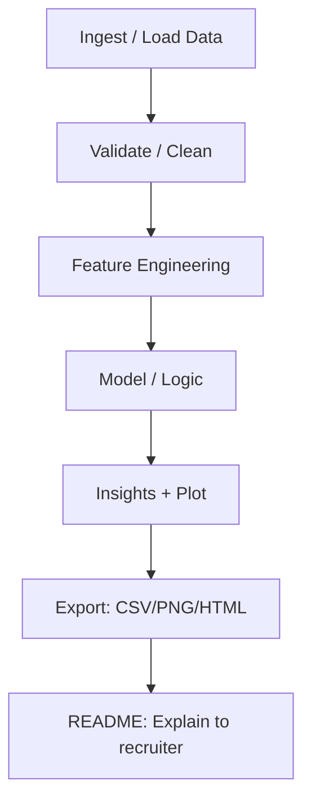

# p14 — Dashboard demo ejecutiva (HTML)

**EN title:** Executive Demo Dashboard




## Objetivo (ES)
Crear una demo **ejecutable** que muestre un flujo completo: datos → features → lógica/modelo → salida (gráfico/artefacto) → explicación.

## Qué incluye
- Dataset simulado: `data/p14_executive_demo_dashboard_data.csv`
- Notebook runnable: `notebooks/p14_executive_demo_dashboard.ipynb`
- Figura exportada: `img/p14_executive_demo_dashboard_plot.png`

## Cómo ejecutar
```bash
python3 -m venv .venv
source .venv/bin/activate
pip install -r requirements.txt
jupyter notebook
```

---

# EN — Goal
Build a **runnable** demo: data → features → model/logic → outputs (plot/artifact) → recruiter-ready narrative.
